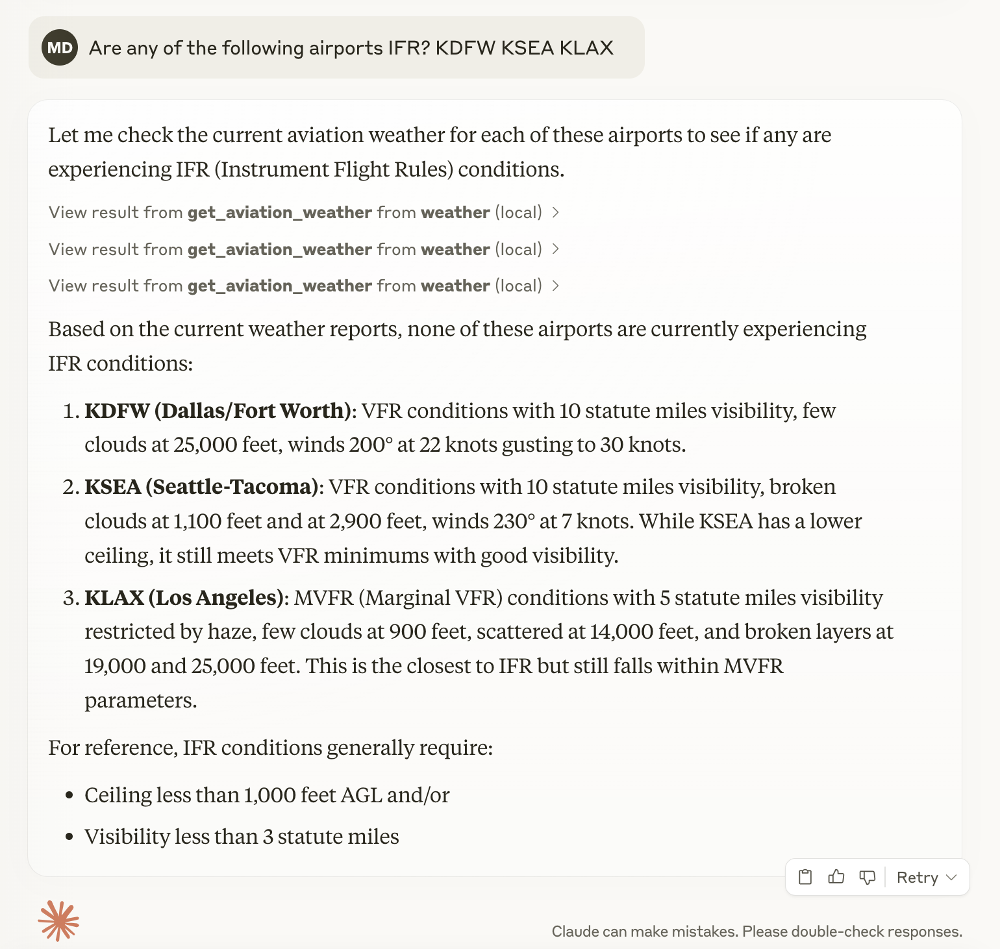

# MCP Demo

This project demonstrates building and using an [MCP Server](https://modelcontextprotocol.io/introduction). The server implemented in this project fetches aviation weather data.

## Using this tool

Here's an example use case:



## Working with this project locally

Set up dependencies:

```
uv sync
```

Activate the virtual environment:

```
source .venv/bin/activate
```

Run the server:

```
mcp dev src/mcp_aviation_weather/server.py
```